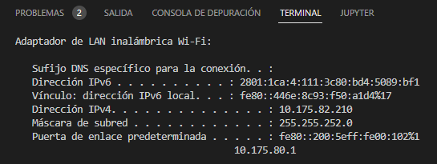
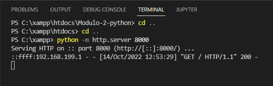

# Servidor local con python

- [Python](https://www.python.org/downloads/)

```sh
# En la terminal
python -m # Acceder a las librerias predeterminadas
python -m http.server + Puerto # Acceder a la libreria http.server
```


```sh
ipconfig # Ver la dirección ip de nuestro equipo (ethernet o wi-fi)
```



6. Nuestro servidor esta disponible en cualquier equipo que se encuentre en la misma red

- Dijitamos la dirección ip seguido del puerto que escogimos en este caso el 8000


- Seguido nos generar un registro del equipo que haya accedido a nuestro servidor local



```sh
Ctrl + c # Para detener el servidor
```
